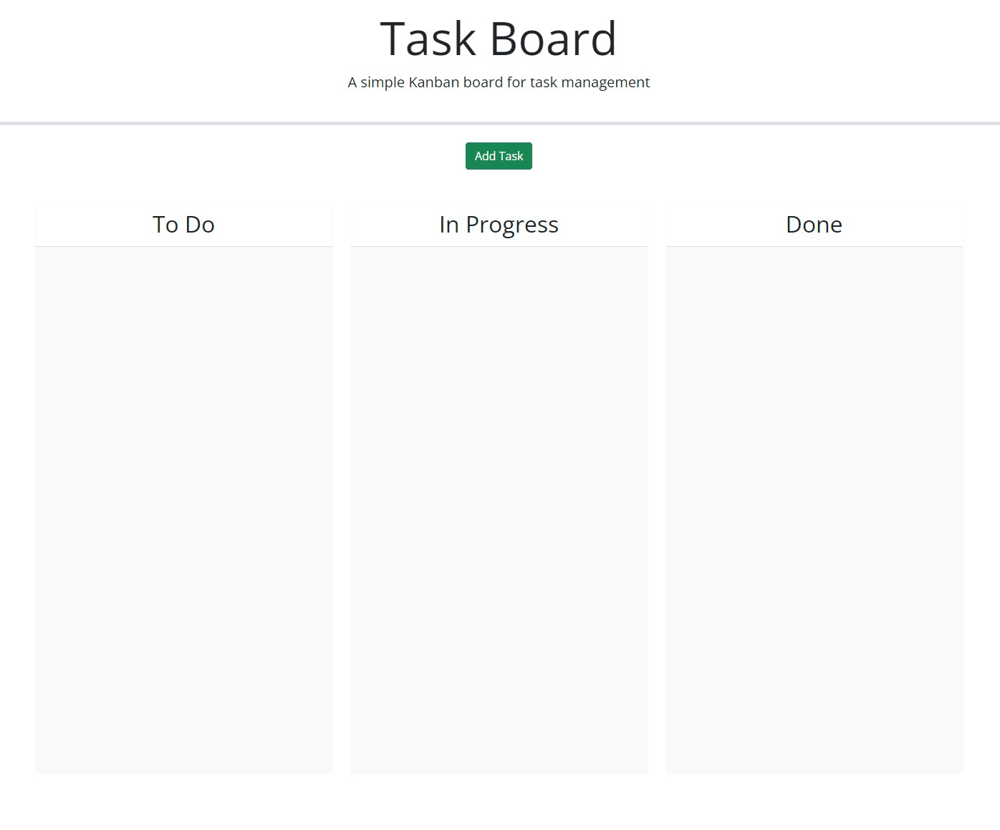
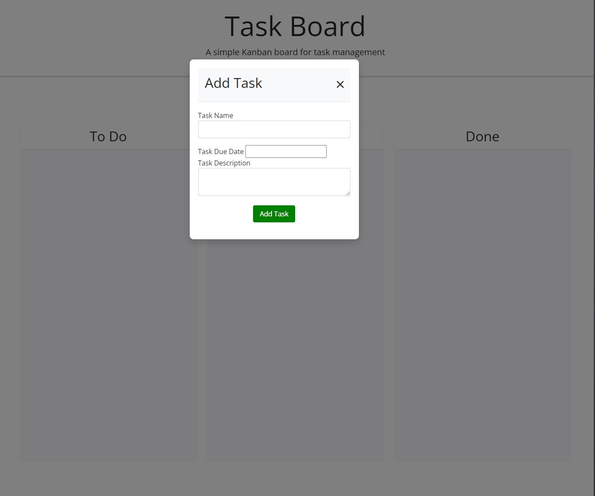
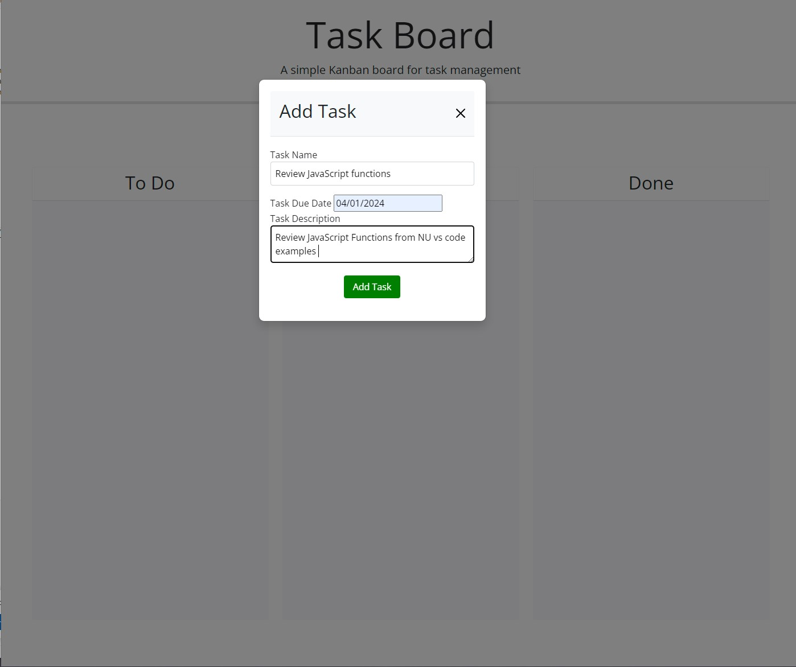
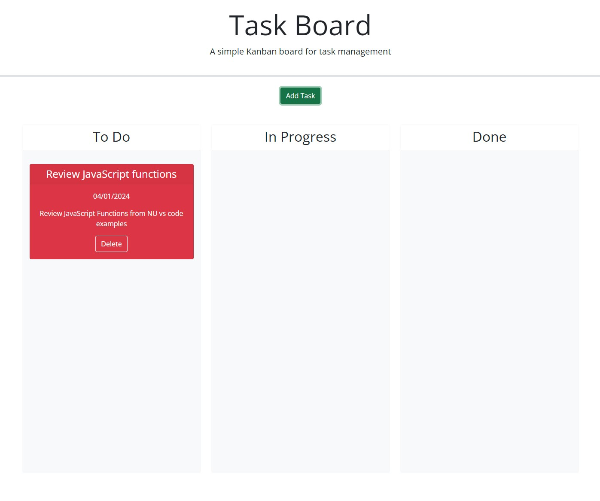
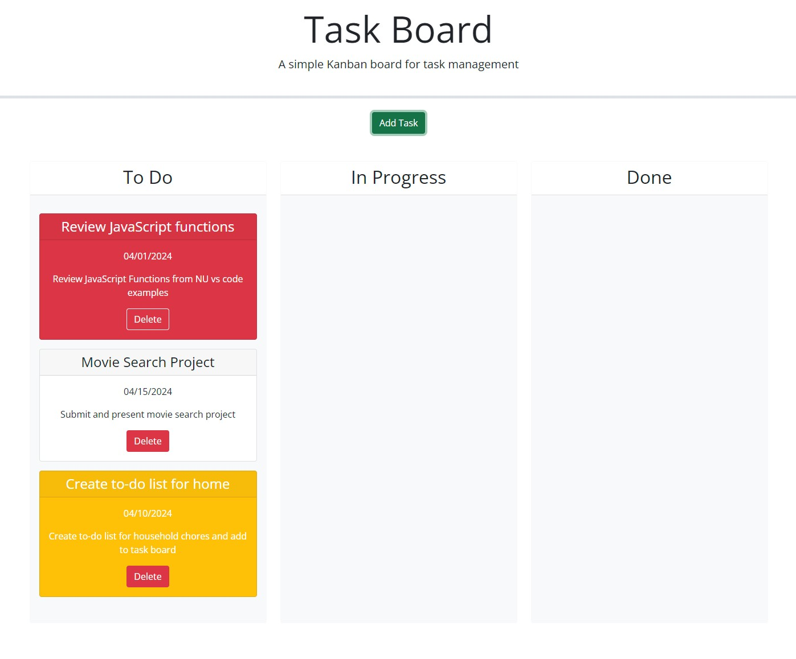
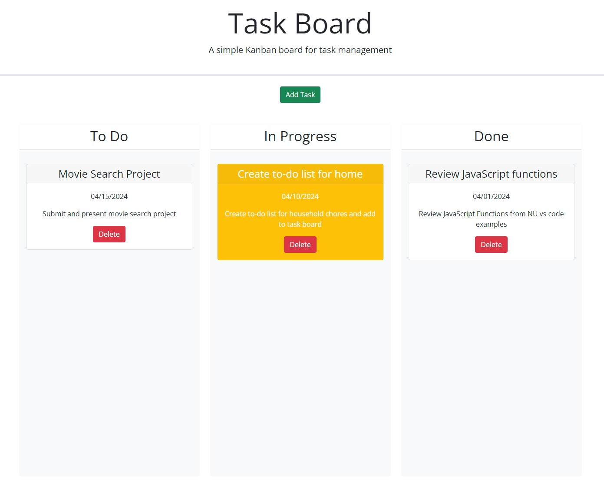
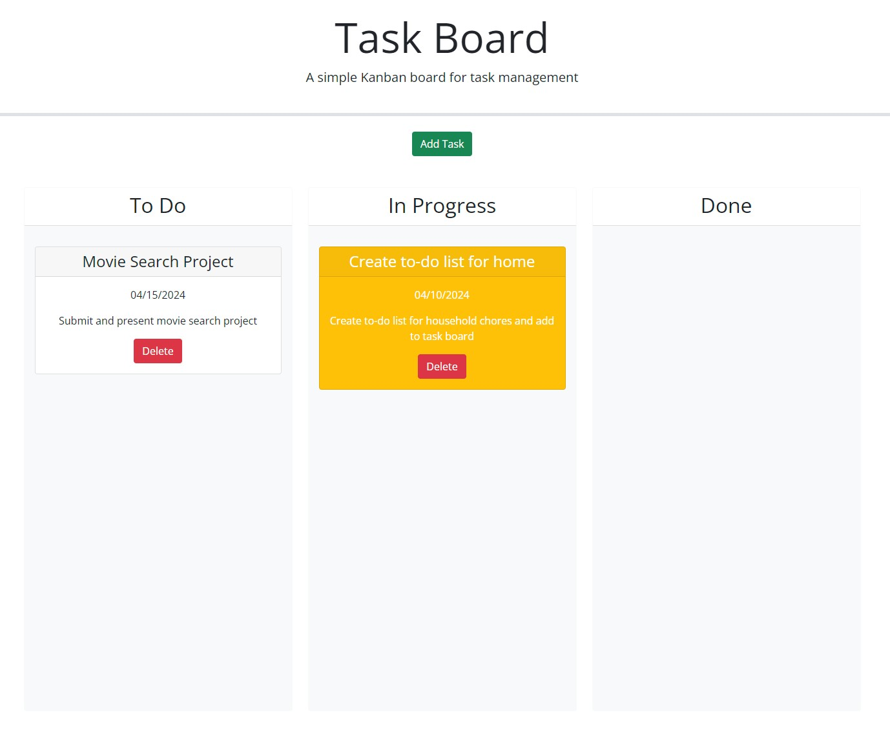

# Task-Board

## Description
Task Board is a simple Kanban board for task management. A user can add, edit, and delete tasks. They can organize tasks into different stages (To Do, In Progress, Done). Due dates can be set for tasks and the user can visually identify overdue tasks. Lastly, tasks can be dragged and dropped between stages. 

## Code Hightlights
* HTML
* CSS
* CSS3(Bootstrap 5)
* JQuery
* JQuery UI
* Day.js
* Javascript 
* Functions
* Objects
* Conditional Statements

## Demo 
Demo App [https://sam-cowman.github.io/Task-Board/](https://sam-cowman.github.io/Task-Board/)

## Usage 
1. Click the "Add Task" button to open the modal.
2. Enter a task name, due date, and description.
3. Click "Add Task" to save the task.
4. Drag and drop tasks between the "To Do", "In Progress", and "Done" columns.
5. Delete task when task is complete.

## License
No License